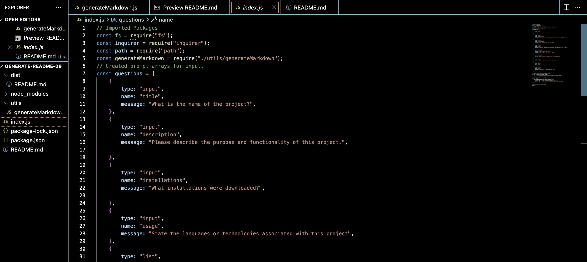
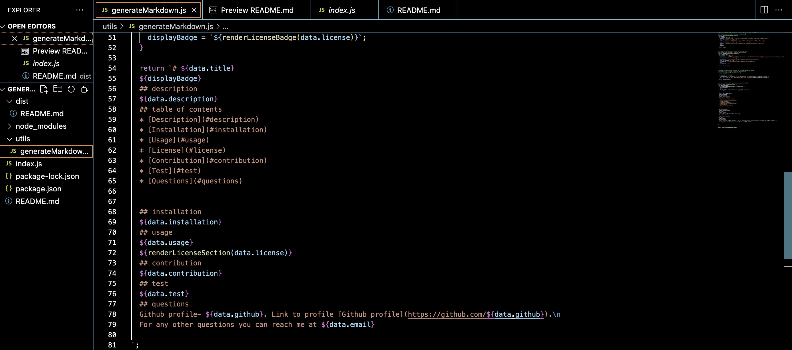

# Generate-Readme-09

## Description
The purpose of this project to create an applicationg that allows a user to generate a README file from the command line.
The motivation of creating this was to incorperate my skills and knowledge of working with Node.js to create a useful application.

## Installations
- inquirer ( npm i inquirer@8.2.4).

## Usage 
- Install inquirer version 8.2.4

- After installing depencies set up packages and link js. files accordingly and then set up your prompts for the user to input their responses to generate the README files.

- Set up generateMarkdown.js file by creating functions to render the license badges and link them to the readme, and creating functions to generate Markdowns for each section of the README.

